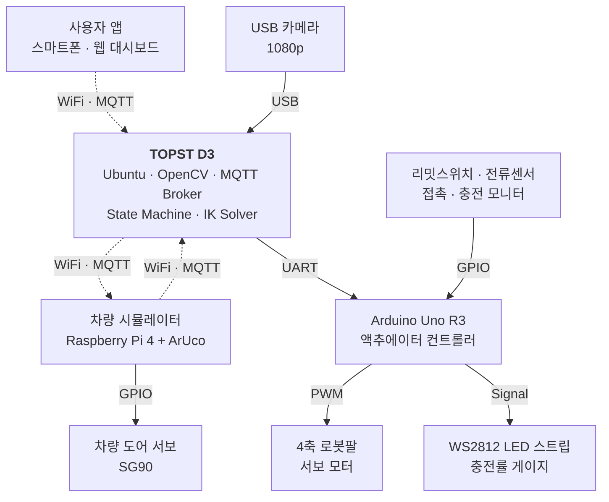

# Microprocessor_project
# AutoPlug — 비전 기반 무인 전기차 자동 충전 시스템

> 차량이 들어오면, 알아서 충전합니다.

**마이크로프로세서 프로젝트 · 2026년 1학기**

---

## 프로젝트 소개

AutoPlug는 사용자가 직접 충전건을 결합하지 않아도, 차량 진입만으로 자동 충전이 시작되는 무인 EV 충전 시스템입니다. 카메라 기반 비전 인식과 4DOF 로봇팔로 충전 포트에 정밀 정렬하며, MQTT 통신으로 차량 · 충전소 · 사용자 앱을 실시간 연동합니다.

본 프로젝트는 실차량 대신 **종이상자 차량 모형 + 4DOF 로봇팔 + TOPST D3 메인 컨트롤러** 환경에서 동일한 동작 시나리오를 재현하는 것을 목표로 합니다.

## 핵심 기능

### 1. 충전건 자동 삽입 · 분리
- USB 카메라로 차량의 ArUco 마커를 인식하여 충전구 좌표 (x, y, z) 실시간 계산
- 4DOF 로봇팔 역기구학(IK) 계산 → 서보 각도 4개 변환
- 비전 피드백 폐쇄루프 제어로 **±5mm 이내 정렬 정밀도** 보장

### 2. 차량 충전구 자동 개폐
- 차량 진입 후 MQTT로 충전 요청 송신
- 충전소가 "OPEN" 명령을 차량에 publish → 라즈베리파이 GPIO가 도어 서보(SG90) 구동
- 충전 종료 시 자동 "CLOSE"

### 3. 실시간 충전률 시각화
- 충전 진행률을 1Hz 주기로 MQTT publish
- Arduino가 UART로 받은 진행률 값에 따라 WS2812 LED 스트립을 게이지로 점진 점등
- 사용자 웹 대시보드에 실시간 표시

## 시스템 구조



### 통신 채널 요약

| 구간 | 프로토콜 | 용도 |
| --- | --- | --- |
| 사용자 앱 ↔ TOPST D3 | WiFi · MQTT | 충전 요청, 진행률 모니터링 |
| 차량 (Pi) ↔ TOPST D3 | WiFi · MQTT | 충전 요청, 도어 제어, 차량 상태 |
| USB 카메라 → TOPST D3 | USB | 영상 입력 (ArUco 인식) |
| TOPST D3 ↔ Arduino | UART (시리얼) | 서보 각도 명령, LED 게이지, 접촉 감지 |
| Arduino → 액추에이터 | PWM · GPIO | 서보 4축, LED 스트립, 센서 |

## 기술 스택

### TOPST D3 (메인 컨트롤러)
- Ubuntu 22.04
- Python 3.10
- OpenCV (ArUco 인식 · 캘리브레이션)
- paho-mqtt (MQTT 클라이언트)
- pyserial (UART 통신)
- Mosquitto (MQTT 브로커)
- Flask + WebSocket (사용자 대시보드)

### Arduino Uno R3
- C++ (Arduino IDE)
- Servo 라이브러리 (4축 PWM)
- FastLED (WS2812 제어)

### Raspberry Pi 4 (차량 시뮬레이터)
- Raspberry Pi OS
- Python 3
- paho-mqtt
- RPi.GPIO

## 하드웨어 구성

| 구분 | 부품 | 수량 | 용도 |
| --- | --- | --- | --- |
| 보드 | TOPST D3 (TCC8053) | 1 | 메인 컨트롤러 |
| 보드 | Raspberry Pi 4 (4GB) | 1 | 차량 시뮬레이터 |
| 보드 | Arduino Uno R3 | 1 | 액추에이터 컨트롤 |
| 기구 | 4DOF 로봇팔 키트 (G56) | 1 | 충전건 정렬 |
| 모터 | MG996R 고출력 서보 | 2 | Base · Shoulder 보강 |
| 모터 | SG90 마이크로 서보 | 1 | 차량 도어 |
| 센서 | USB 카메라 (1080p) | 1 | ArUco 마커 인식 |
| 센서 | ACS712 전류 센서 + 리밋 스위치 | 1세트 | 충전 모니터 · 접촉 감지 |
| 출력 | WS2812 LED 스트립 | 1 | 충전률 게이지 |
| 기타 | 5V 5A DC 어댑터 · 점퍼 · 종이상자 | - | 전원 · 차량 모형 |

## 프로젝트 구조

```
autoplug/
├── topst/                       # TOPST D3 메인 컨트롤러 (팀원 A)
│   ├── vision/
│   │   ├── aruco_detector.py    # ArUco 마커 인식
│   │   └── calibration.py       # 카메라 캘리브레이션
│   ├── control/
│   │   ├── inverse_kinematics.py
│   │   └── state_machine.py     # 충전 상태 머신
│   ├── comm/
│   │   ├── mqtt_client.py
│   │   └── uart_client.py
│   ├── dashboard/
│   │   ├── app.py               # Flask 웹 대시보드
│   │   └── templates/
│   └── main.py
│
├── arduino/                     # Arduino 펌웨어 (팀원 B)
│   └── autoplug_firmware/
│       └── autoplug_firmware.ino
│
├── vehicle_pi/                  # 라즈베리파이 차량 (팀원 B)
│   ├── mqtt_client.py
│   ├── door_controller.py
│   └── main.py
│
├── docs/                        # 인터페이스 합의 문서
│   ├── mqtt_topics.md           # MQTT 토픽 명세 (A)
│   ├── uart_protocol.md         # UART 명령 명세 (B)
│   └── architecture.md
│
└── README.md
```

## 팀 구성 및 역할 분담

### 팀원 A — 메인 컨트롤러 · 통신 허브 (소프트웨어)
- TOPST D3 Ubuntu 환경 구축 및 Python 기반 SW 전반
- OpenCV ArUco 마커 인식 및 좌표 캘리브레이션
- 4DOF 역기구학(IK) 계산 및 비전 피드백 폐쇄루프 정렬
- Mosquitto MQTT 브로커 운영 및 토픽 설계
- 충전 상태 머신 및 가상 충전률 시뮬레이션
- 사용자 웹 대시보드 (Flask + WebSocket)
- **산출물**: TOPST Python 코드 일체, MQTT 토픽 명세 문서, 인식 정확도 측정 데이터

### 팀원 B — 엣지 디바이스 펌웨어 (임베디드)
- Arduino C++ 펌웨어 (서보 4축, LED 게이지, 리밋스위치 인터럽트)
- WS2812 LED 점진 점등 알고리즘
- Raspberry Pi 차량 시뮬레이터 (MQTT 클라이언트, GPIO 도어 제어)
- UART 명령 프로토콜 설계 및 구현
- 디바이스 간 동기화 및 인터럽트 처리
- **산출물**: Arduino C++ 펌웨어, Pi Python 클라이언트, UART 프로토콜 명세 문서

### 공동 작업
- 로봇팔 키트 조립 · 종이상자 차량 제작 · 회로 배선
- ArUco 마커 부착 위치 결정 및 카메라 거치 캘리브레이션
- 통합 디버깅 · 시연 리허설 · 보고서 작성

## 4주 일정

| 주차 | 주요 마일스톤 | 팀원 A | 팀원 B |
| --- | --- | --- | --- |
| **Week 1** | 부품 발주 · 환경 구성 | TOPST + OpenCV ArUco 단독 인식 | Arduino + 서보 4축 단독 동작 |
| **Week 2** | 모듈 통합 (중간발표) | MQTT 브로커 · 토픽 설계 완료 | Pi 도어 제어 · LED 게이지 동작 |
| **Week 3** | 통신 · 정렬 통합 | 비전 폐쇄루프 · 대시보드 | UART 통신 통합 · 인터럽트 처리 |
| **Week 4** | 시연 리허설 (최종발표) | 시연 리허설 · 보고서 작성 | 시연 리허설 · 보고서 작성 |

## 성능 목표 (KPI)

| 지표 | 목표값 |
| --- | --- |
| 충전 요청 → 충전 시작 | 10초 이내 |
| 마커 인식 좌표 정확도 | ±5mm 이내 |
| 충전건 정렬 성공률 | 8 / 10 이상 |
| MQTT 메시지 왕복 지연 | 200ms 이하 |
| 진행률 업데이트 주기 | 1Hz |

## Getting Started

### TOPST D3 (메인 컨트롤러)

```bash
git clone https://github.com/[your-team]/autoplug.git
cd autoplug/topst

# 의존성 설치
pip install -r requirements.txt

# MQTT 브로커 실행
sudo systemctl start mosquitto

# 메인 컨트롤러 실행
python main.py
```

### Arduino Uno

1. Arduino IDE로 `arduino/autoplug_firmware/autoplug_firmware.ino` 열기
2. 라이브러리 매니저에서 **Servo**, **FastLED** 설치
3. 보드: **Arduino Uno** 선택
4. 시리얼 포트 확인 후 업로드 (기본 115200 bps)

### Raspberry Pi (차량 시뮬레이터)

```bash
cd vehicle_pi
pip install -r requirements.txt

# 충전소 IP를 명시하여 실행
python main.py --broker [TOPST_IP] --vehicle-id EV-001
```

## 인터페이스 명세 (요약)

### MQTT 토픽 예시
- `station/{station_id}/request` — 차량의 충전 요청
- `station/{station_id}/status` — 충전소 상태 broadcast
- `vehicle/{vehicle_id}/door` — 차량 도어 OPEN/CLOSE 명령
- `vehicle/{vehicle_id}/progress` — 충전 진행률 (1Hz)

자세한 내용은 [`docs/mqtt_topics.md`](docs/mqtt_topics.md) 참조.

### UART 명령 예시
- `M <s1> <s2> <s3> <s4>\n` — 서보 4축 각도 명령 (0~180)
- `L <percent>\n` — LED 게이지 점등 (0~100)
- `H\n` — 홈 위치 복귀
- `S\n` — 상태 조회 (Arduino → TOPST)

자세한 내용은 [`docs/uart_protocol.md`](docs/uart_protocol.md) 참조.

## 기대 효과

- **기술적**: 비전 기반 폐쇄루프 제어, 이종 보드 시리얼 프로토콜, MQTT IoT 게이트웨이 노하우 확보
- **산업적**: 무인 충전소 운영 인건비 절감, 24시간 무인 운영, 야간 · 악천후 환경 안정성 향상
- **사회적**: 장애인 · 고령자 등 충전 약자의 접근성 개선

## 라이선스 및 정보

본 프로젝트는 **[학교명] 마이크로프로세서 (2026-1)** 교과목 프로젝트로 진행됩니다.

**Team Members**: [팀원 1], [팀원 2]
**Last Updated**: 2026.05.13
