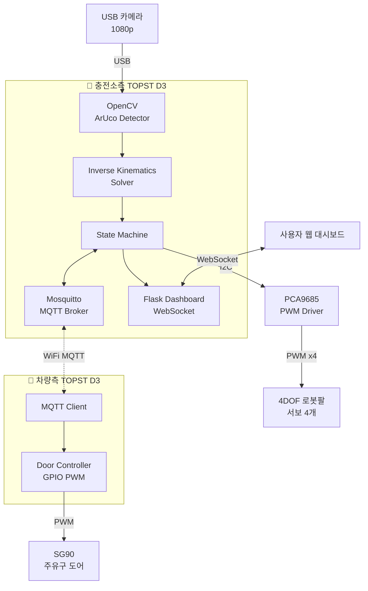
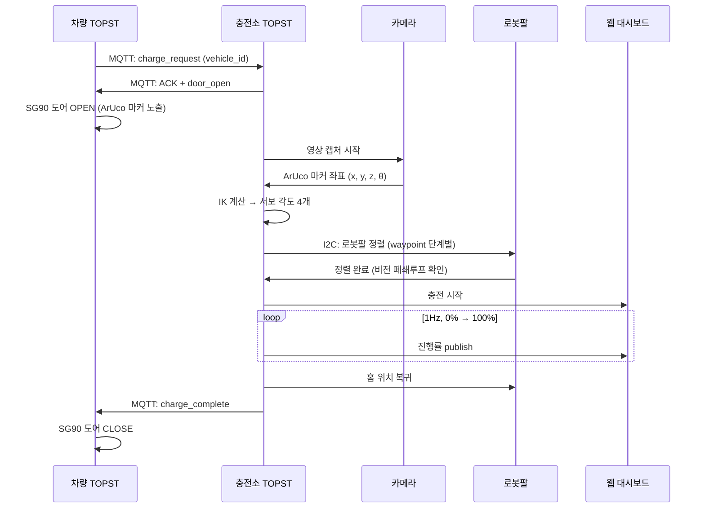

# AutoPlug — 비전 기반 무인 EV 자동 충전 시스템 (수정안 v2)

> **변경 요약 (2026.05.19)**: 라즈베리파이 / 아두이노 의존성을 제거하고 **TOPST D3 2개 + PCA9685**로 아키텍처를 재구성. 차량 모형은 **폼보드 SUV 실루엣**으로 시연 퀄리티 강화.

---

## 1. 수정된 시스템 아키텍처

### 1.1 하드웨어 구성 (최종)

| 구분 | 부품 | 수량 | 용도 | 비고 |
| --- | --- | --- | --- | --- |
| 메인보드 | **TOPST D3 (충전소측)** | 1 | 비전 + IK + MQTT 브로커 + 대시보드 | 카메라 / 로봇팔 제어 |
| 메인보드 | **TOPST D3 (차량측)** | 1 | MQTT 클라이언트 + 도어 제어 | 차량 시뮬레이터 |
| 드라이버 | **PCA9685 16채널 PWM** | 1 | 서보 4축 하드웨어 PWM | I2C, 약 8,000원 |
| 기구 | 4DOF 아크릴 로봇팔 키트 (Scipia G56) | 1 | 충전건 정렬 | 이미 보유 |
| 모터 | 키트 포함 SG90 / MG90S 서보 | 4 | 로봇팔 4축 | Base · Shoulder · Elbow · Gripper |
| 모터 | SG90 마이크로 서보 | 1 | 차량 주유구 도어 | 차량측 GPIO PWM |
| 센서 | USB 카메라 (1080p) | 1 | ArUco 마커 인식 | 충전소측 TOPST에 연결 |
| 전원 | 5V 3A 이상 DC 어댑터 | 1 | 서보 전원 (PCA9685 V+) | **PC USB 금지** |
| 기구 | 폼보드 (우드락) 5T | 2장 | 차량 SUV 모형 | 다이소 |
| 마커 | ArUco 4x4_50 (5cm × 5cm) | 2 | 충전구 위치 인식 | 도어 안쪽 부착 |
| 소품 | 충전건 모형 (나무젓가락 + LED + 3D프린트 헤드) | 1 | 시연용 | 그리퍼가 잡음 |

**제외된 부품**: Raspberry Pi, Arduino Uno, WS2812 LED 스트립, ACS712 전류센서 → 모두 SW 시뮬레이션으로 대체

### 1.2 아키텍처 다이어그램



### 1.3 통신 채널 요약

| 구간 | 프로토콜 | 용도 |
| --- | --- | --- |
| 사용자 브라우저 ↔ 충전소 TOPST | WebSocket | 실시간 충전 상태 / 진행률 |
| 차량 TOPST ↔ 충전소 TOPST | WiFi · MQTT | 충전 요청, 도어 명령, 상태 동기화 |
| USB 카메라 → 충전소 TOPST | USB | 영상 입력 |
| 충전소 TOPST → PCA9685 | I2C (SDA/SCL) | 서보 4축 PWM 명령 |
| PCA9685 → 서보 | PWM | 50Hz 듀티 사이클 |
| 차량 TOPST → SG90 | GPIO PWM | 도어 1축 제어 |

---

## 2. 시연 시나리오



---

## 3. 프로젝트 구조 (수정)

```
autoplug/
├── station/                         # 충전소측 TOPST D3
│   ├── vision/
│   │   ├── aruco_detector.py        # ArUco 4x4 마커 인식
│   │   ├── calibration.py           # 카메라 내부 파라미터 캘리브레이션
│   │   └── coordinate_transform.py  # 카메라→로봇 좌표계 변환
│   ├── control/
│   │   ├── inverse_kinematics.py    # 4DOF Closed-form IK
│   │   ├── servo_driver.py          # PCA9685 래퍼
│   │   └── state_machine.py         # 충전 상태 머신
│   ├── comm/
│   │   └── mqtt_handler.py          # 브로커 + publish/subscribe
│   ├── dashboard/
│   │   ├── app.py                   # Flask + Flask-SocketIO
│   │   └── templates/index.html
│   ├── config.yaml                  # IP, 핀맵, 캘리브레이션 값
│   └── main.py
│
├── vehicle/                         # 차량측 TOPST D3
│   ├── mqtt_client.py
│   ├── door_controller.py           # GPIO PWM
│   └── main.py
│
├── docs/
│   ├── mqtt_topics.md
│   ├── i2c_wiring.md                # PCA9685 결선도
│   └── architecture.md
│
├── hardware/
│   └── car_template.svg             # 폼보드 차량 컷팅 도면
│
└── README.md
```

---

## 4. 핵심 코드 스켈레톤

### 4.1 PCA9685 서보 드라이버 (`station/control/servo_driver.py`)

```python
from adafruit_servokit import ServoKit
import time

class RobotArm:
    """4DOF 로봇팔 PCA9685 제어 래퍼.
    채널 0: Base (좌우회전), 1: Shoulder, 2: Elbow, 3: Gripper
    """
    HOME = [90, 90, 90, 30]   # 홈 자세 (도)
    LIMITS = [(0, 180), (20, 160), (20, 160), (10, 80)]

    def __init__(self, i2c_address=0x40, freq=50):
        self.kit = ServoKit(channels=16, address=i2c_address)
        for i in range(4):
            self.kit.servo[i].set_pulse_width_range(500, 2400)
        self.current = list(self.HOME)

    def move_to(self, angles, speed_deg_per_sec=60):
        """선형 보간으로 부드럽게 이동 (서보 jitter 최소화)."""
        clamped = [max(lo, min(hi, a)) for a, (lo, hi) in zip(angles, self.LIMITS)]
        steps = 30
        dt = max(abs(c - n) for c, n in zip(self.current, clamped)) / speed_deg_per_sec / steps
        for s in range(1, steps + 1):
            t = s / steps
            for i in range(4):
                interp = self.current[i] + (clamped[i] - self.current[i]) * t
                self.kit.servo[i].angle = interp
            time.sleep(dt)
        self.current = clamped

    def home(self):
        self.move_to(self.HOME, speed_deg_per_sec=45)
```

### 4.2 4DOF Closed-form IK (`station/control/inverse_kinematics.py`)

```python
import math

# 로봇팔 링크 길이 (mm) — 실측 후 보정 필요
L1 = 45    # base → shoulder 높이
L2 = 95    # shoulder → elbow
L3 = 100   # elbow → gripper tip

def solve_ik(x, y, z):
    """목표점 (x, y, z) → (θ_base, θ_shoulder, θ_elbow) [degrees].
    z축: 위 방향, x-y: 지면 평면. 그리퍼는 항상 수평이라 가정.
    """
    # 1) Base 회전 (yaw)
    theta_base = math.degrees(math.atan2(y, x))

    # 2) 평면 거리
    r = math.hypot(x, y)
    dz = z - L1

    # 3) Elbow 각도 (코사인 법칙)
    D = (r ** 2 + dz ** 2 - L2 ** 2 - L3 ** 2) / (2 * L2 * L3)
    D = max(-1.0, min(1.0, D))   # 도메인 클램프 (수치 안전)
    theta_elbow = math.degrees(math.acos(D))

    # 4) Shoulder 각도
    theta_shoulder = math.degrees(
        math.atan2(dz, r) - math.atan2(L3 * math.sin(math.radians(theta_elbow)),
                                       L2 + L3 * math.cos(math.radians(theta_elbow)))
    )

    # 5) 서보 좌표계 변환 (0~180 매핑) — 조립 후 캘리브레이션
    base_servo     = 90 + theta_base
    shoulder_servo = 90 - theta_shoulder
    elbow_servo    = 180 - theta_elbow
    return base_servo, shoulder_servo, elbow_servo
```

### 4.3 ArUco 검출 (`station/vision/aruco_detector.py`)

```python
import cv2
import numpy as np

class ArucoDetector:
    def __init__(self, camera_matrix, dist_coeffs, marker_length=0.05):
        self.dictionary = cv2.aruco.getPredefinedDictionary(cv2.aruco.DICT_4X4_50)
        self.params = cv2.aruco.DetectorParameters()
        self.detector = cv2.aruco.ArucoDetector(self.dictionary, self.params)
        self.K = camera_matrix
        self.D = dist_coeffs
        self.L = marker_length

    def detect(self, frame):
        """프레임에서 마커 검출 → (id, tvec, rvec) 리스트."""
        corners, ids, _ = self.detector.detectMarkers(frame)
        if ids is None:
            return []
        rvecs, tvecs, _ = cv2.aruco.estimatePoseSingleMarkers(
            corners, self.L, self.K, self.D
        )
        return [(int(ids[i][0]), tvecs[i][0], rvecs[i][0]) for i in range(len(ids))]
```

### 4.4 상태 머신 (`station/control/state_machine.py`)

```python
from enum import Enum, auto

class State(Enum):
    IDLE = auto()
    REQUEST_RECEIVED = auto()
    DOOR_OPENING = auto()
    DETECTING_MARKER = auto()
    ALIGNING = auto()
    CHARGING = auto()
    COMPLETE = auto()
    DOOR_CLOSING = auto()
    ERROR = auto()

# 전이 규칙은 main.py의 메인 루프에서 처리
# 각 상태는 진입 시 1회 실행되는 on_enter 콜백을 가짐
```

### 4.5 차량측 도어 컨트롤러 (`vehicle/door_controller.py`)

```python
# TOPST D3 GPIO 라이브러리는 보드 SDK에 따라 다름.
# Telechips SDK / RPi.GPIO 호환 라이브러리 중 환경에 맞는 것 사용.
import time

try:
    import RPi.GPIO as GPIO   # 호환 라이브러리가 있다면
except ImportError:
    from periphery import PWM  # python-periphery 대안

class DoorController:
    OPEN_ANGLE = 90
    CLOSE_ANGLE = 0

    def __init__(self, pwm_chip=0, pwm_channel=0):
        self.pwm = PWM(pwm_chip, pwm_channel)
        self.pwm.frequency = 50
        self.pwm.enable()

    def _set_angle(self, angle):
        duty = 0.025 + (angle / 180.0) * (0.125 - 0.025)
        self.pwm.duty_cycle = duty

    def open(self):
        self._set_angle(self.OPEN_ANGLE)
        time.sleep(0.6)

    def close(self):
        self._set_angle(self.CLOSE_ANGLE)
        time.sleep(0.6)
```

---

## 5. 하드웨어 설계 / 배선

### 5.1 PCA9685 결선

```
TOPST D3              PCA9685
  3.3V  ────────────  VCC  (로직 전원)
  GND   ────────────  GND
  SDA   ────────────  SDA
  SCL   ────────────  SCL

5V 3A 어댑터          PCA9685
  +5V   ────────────  V+   (서보 구동 전원 ⚠️ 절대 TOPST와 공유 X)
  GND   ────────────  GND  (단, GND는 TOPST GND와 공통)

PCA9685 채널 0~3 → 로봇팔 서보 (Base / Shoulder / Elbow / Gripper)
```

**⚠️ 전원 주의사항**
- 서보 4개 동시 동작 시 순간 전류 2A 이상 발생 가능 → **반드시 별도 5V 3A 어댑터 사용**
- TOPST의 5V 핀에서 서보 전원 절대 끌어오지 말 것 (보드 손상 위험)
- V+에 1000μF 전해 캐패시터 추가 권장 (서보 기동 시 전압 강하 완화)

### 5.2 차량 모형 (폼보드 SUV)

```
       옆모습 (가로 250mm × 세로 120mm, 5T 폼보드)

   ┌────────────────────────────────┐
   │                                 │ ← 지붕
   │     ●            ●              │ ← 창문
   │  ┌─────┐      ┌─────┐           │
   │  │ ▓▓▓ │      │     │ ← ArUco   │ ← 충전구 도어
   │  └─────┘      └─────┘    (도어 안쪽 부착)
   │   ◯              ◯              │ ← 바퀴
   └────────────────────────────────┘

   - 충전구: 옆면 우측에 60×60mm 정사각 컷아웃
   - 도어: 70×70mm 폼보드 조각 + SG90 힌지
   - ArUco 4x4 (id=0), 5cm 크기, 도어 안쪽에 부착
   - 무광 검정 스프레이 도색 후 마스킹으로 창문 부분 흰색
```

---

## 6. 이번 주 로드맵 (6일, 1인당 12~18시간)

### Day 1 (오늘 / 화) — 환경 구축
**팀원 A (충전소)**
- [ ] TOPST D3 Ubuntu에 Python 3.10, OpenCV 4.x, paho-mqtt, Flask 설치
- [ ] Mosquitto 설치 및 `mosquitto_pub` / `mosquitto_sub` 로컬 테스트
- [ ] USB 카메라 인식 확인 (`v4l2-ctl --list-devices`)

**팀원 B (차량)**
- [ ] 두 번째 TOPST D3 Ubuntu 환경 셋업
- [ ] PCA9685 발주 (당일 / 익일 도착 가능한 곳)
- [ ] 폼보드, 검정 스프레이, ArUco 마커 출력용 시트지 다이소 / 알파문구 구매

### Day 2 (수) — 단독 동작 검증
**팀원 A**
- [ ] OpenCV ArUco 마커 인식 단독 코드 작성 (`aruco_detector.py`)
- [ ] 출력한 마커 종이를 카메라 앞에 두고 ID + tvec 출력 확인
- [ ] 카메라 캘리브레이션 코드 작성 (체스보드 9×6 출력해서 20장 촬영)

**팀원 B**
- [ ] PCA9685 도착 후 I2C 결선 및 `i2cdetect -y 1`로 0x40 주소 확인
- [ ] `adafruit-circuitpython-servokit` 설치
- [ ] 서보 1개부터 0°→90°→180° 스윕 테스트, 안정되면 4개 모두 연결

### Day 3 (목) — 핵심 알고리즘
**팀원 A**
- [ ] 카메라 캘리브레이션 완료 (`camera_matrix`, `dist_coeffs` 저장)
- [ ] 카메라→로봇 좌표계 변환 행렬 도출 (마커 4개 모서리로 호모그래피)
- [ ] MQTT publish / subscribe 양방향 테스트 (두 TOPST 간)

**팀원 B**
- [ ] 로봇팔 링크 길이 (L1, L2, L3) 실측
- [ ] IK 코드 작성 후 단위 테스트: `solve_ik(100, 0, 50)` 결과를 로봇팔에 명령해서 실제 도달하는지 확인
- [ ] 폼보드 차량 옆판 컷팅 및 도색 시작 (건조 시간 확보)

### Day 4 (금) — 통합 1차
**팀원 A**
- [ ] 상태 머신 골격 (`state_machine.py`) + MQTT 핸들러 연결
- [ ] Flask 대시보드 기본 UI (상태 표시 + 진행률 바)

**팀원 B**
- [ ] 차량측 도어 컨트롤러 코드 + SG90 결선
- [ ] 차량 모형 조립 완료 (도어 + ArUco 부착)
- [ ] 차량측 main.py: MQTT 수신 → 도어 OPEN/CLOSE 동작 확인

### Day 5 (토) — 통합 2차 (End-to-End)
**공동 작업**
- [ ] 시연 시나리오 전체 흐름 1회 통과 시도
  1. 차량 → 충전소: 충전 요청
  2. 도어 OPEN → 마커 인식 → IK → 로봇팔 정렬
  3. 진행률 시뮬레이션 (0~100%)
  4. 완료 → 홈복귀 → 도어 CLOSE
- [ ] 발생한 버그 / 좌표계 어긋남 / 타이밍 이슈 기록
- [ ] 정렬 정확도 5회 측정 (목표: ±10mm 이내)

### Day 6 (일) — 중간발표 준비
- [ ] 시연 영상 촬영 (성공 사례 3개 이상 확보)
- [ ] 중간발표 슬라이드 5~7장
  - 문제 정의 / 시스템 아키텍처 / 현재 진행률 / 데모 / 남은 과제
- [ ] README 업데이트 및 GitHub 푸시
- [ ] 발표 리허설 1회

---

## 7. 위험 요소 및 완충 계획

| 리스크 | 가능성 | 영향 | 완충 계획 |
| --- | --- | --- | --- |
| PCA9685 배송 지연 | 중 | 높음 | 일렉파츠 / 디바이스마트 당일배송 옵션 확인, 백업으로 ESP32 + 서보 직제어 |
| ArUco 인식 불안정 (조명) | 중 | 중 | 시연 장소 조명 사전 확인, 백색 LED 보조광 준비 |
| IK 좌표 오차 누적 | 높음 | 중 | 비전 폐쇄루프로 cm 단위 보정, 마커 위치를 단계적으로 접근 |
| 서보 jitter / 기동 전류 | 중 | 중 | 별도 5V 3A 어댑터 + 1000μF 캐패시터, 동시 이동 대신 순차 이동 |
| 두 TOPST WiFi 끊김 | 낮음 | 높음 | 이더넷 직결 또는 핫스팟 백업, MQTT QoS 1 사용 |
| 로봇팔 도달 범위 부족 | 중 | 높음 | 차량 모형과 로봇팔 거리 사전 측정 (실측: 가로 15~20cm 권장) |

---

## 8. 수정된 KPI

| 지표 | 기존 목표 | 수정 목표 | 근거 |
| --- | --- | --- | --- |
| 충전 요청 → 충전 시작 | 10초 | **15초** | 도어 개폐 + 비전 안정화 시간 포함 |
| 마커 인식 좌표 정확도 | ±5mm | **±10mm** | 키트 서보 jitter + 아크릴 휨 현실 반영 |
| 충전건 정렬 성공률 | 8/10 | **7/10** | 폐쇄루프 보정 전제 |
| MQTT 왕복 지연 | 200ms | 200ms | 유지 |
| 진행률 업데이트 주기 | 1Hz | 1Hz | 유지 |

---

## 9. 이번 주차 산출물 체크리스트

- [ ] `station/vision/aruco_detector.py` — 동작 확인
- [ ] `station/control/inverse_kinematics.py` — 단위 테스트 통과
- [ ] `station/control/servo_driver.py` — 4축 부드러운 이동 확인
- [ ] `station/comm/mqtt_handler.py` — 두 보드 간 송수신 확인
- [ ] `vehicle/main.py` — 도어 OPEN/CLOSE 확인
- [ ] `hardware/car_template.svg` — 폼보드 컷팅 도면
- [ ] 차량 모형 실물 완성
- [ ] End-to-End 시연 영상 1개 이상

---

**문서 버전**: v2.0 (2026.05.19)
**다음 업데이트**: 중간발표 직후 v3.0 (실측 KPI 반영)
